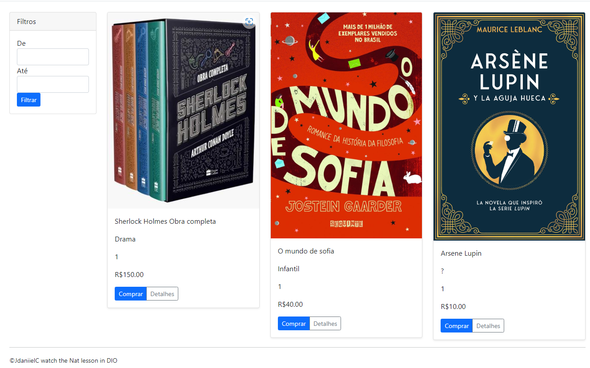

# E-commerce in Angular

Projeto incentivado pela plataforma DIO, referente ao curso Angular, criando um exemplo de E-commerce.
Aula fez parte do Bootcamp Geração Tech Unimed-BH | Fullstack

## Tema

O Tema do E-commerce é livros.

## Como rodar?

Obter o CLI do Angular: https://angular.io/cli.
Rode 'ng serve'
